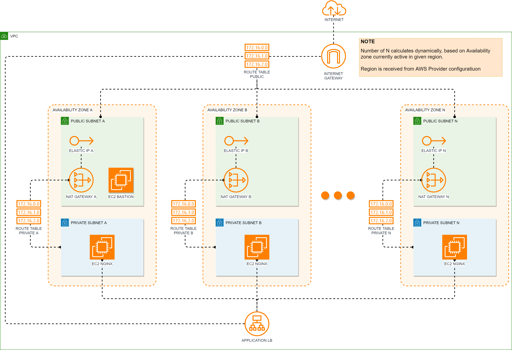

# Test Terraform and Ansible with AWS

## What is it for
This repo contains sample of usage ```Terraform``` and ```Ansible``` to deploy some infrastructure into Amazon cloud.
It will create such components as:
- SSH Bastion host
- Pack of ```Nginx```  server with static page, each in separate Avalability Zone
- Simple default page with server name for ```Nginx```
- Application Load Balancer
- VPC, Subnets, Route tables, NAT Gateways, Security zones, etc.

## Scheme

[  ](./images/scheme.png)

## Requirements
To run this scripts you will need at least this: 
- Terraform 1.0+
- Ansible-core 2.10+
- Python 3.8+
- Jinja 2.10+
- Git
- AWS Secret Key file
- AWS Access Key file

## How to launch
1. First of all, clone this repo
2. (Optional) Create SSH key pairs for Nginx and Bastion instance:
    ```
    $ ssh-keygen -t rsa -b 4096 -N "" -f id_rsa_nginx
    $ ssh-keygen -t rsa -b 4096 -N "" -f id_rsa_bastion
    ```  

3. In ```varibles.tf``` fill the path to SSH Private and Public keys
4. In ```varibles.tf``` fill the path to your AWS keys
5. Change number of VPC, if you need to
6. Initialize and run
    ```
    $ terraform init
    $ terraform apply --auto-approve
    ```
7. Test your infrastructure, with commands printed by ```output.tf```

## To do
 - [x] add README.MD
 - [x] add Diagram of components
 - [x] add Ansible roles
 - [ ] modify SG to be more precise
 - [ ] add some other fancy stuff